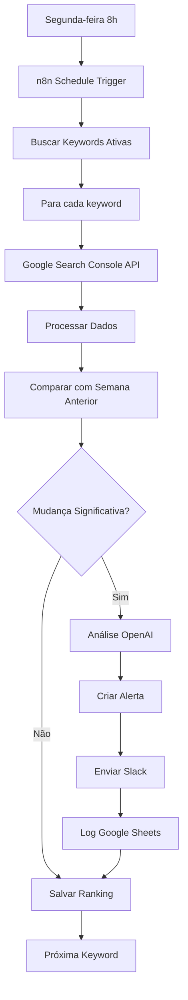

# 🚀 NeuroVendas SEO Monitoring

Aplicação completa de monitoramento de SEO com Google Search Console, análise com IA e automação semanal via n8n.


---

## 📋 Funcionalidades

### ✅ Monitoramento Automático
- Rastreamento semanal de rankings via Google Search Console API
- Coleta automática de dados de posição, impressões, cliques e CTR
- Histórico completo de 12 semanas por keyword

### 📊 Dashboard Inteligente
- Cards de resumo (total keywords, posição média, melhorias/quedas)
- Gráficos de tendência interativos com Recharts
- Lista de keywords com status em tempo real
- Página de detalhes com histórico completo

### 🔔 Alertas Automáticos
- Detecção de mudanças significativas (±3 posições)
- Notificações via Slack e Email
- Log automático em Google Sheets
- Sistema de alertas no aplicativo

### 🤖 Análise com IA
- Insights gerados por OpenAI GPT-4o
- Recomendações de otimização automáticas
- Análise de tendências e padrões

### ⚙️ Automação n8n
- Workflow completo pré-configurado
- Execução semanal automática (segunda-feira 8h)
- Integração com múltiplos serviços
- Fácil customização

---

## 🛠️ Stack Tecnológica

### Frontend
- **React 19** - Interface do usuário
- **TypeScript** - Tipagem estática
- **Tailwind CSS 4** - Estilização
- **shadcn/ui** - Componentes UI
- **Recharts** - Gráficos
- **tRPC** - Type-safe API
- **Wouter** - Roteamento

### Backend
- **Node.js 22** - Runtime
- **Express 4** - Servidor HTTP
- **tRPC 11** - API type-safe
- **Drizzle ORM** - Database ORM
- **MySQL/TiDB** - Banco de dados

### Integrações
- **Google Search Console API** - Dados de ranking
- **OpenAI GPT-4o** - Análise com IA
- **n8n** - Automação de workflows
- **Slack** - Alertas
- **Google Sheets** - Logs

---

## 🚀 Quick Start

### Pré-requisitos

```bash
Node.js >= 22.0.0
pnpm >= 10.0.0
```

### Instalação

```bash
# Clone o repositório
git clone https://github.com/seu-usuario/neurovend-seo-monitoring.git

# Entre no diretório
cd neurovend-seo-monitoring

# Instale as dependências
pnpm install

# Configure as variáveis de ambiente
cp .env.example .env

# Execute as migrações do banco de dados
pnpm db:push

# Inicie o servidor de desenvolvimento
pnpm dev
```

O aplicativo estará disponível em `http://localhost:3000`

---

## 📁 Estrutura do Projeto

```
neurovend-seo-monitoring/
├── client/                 # Frontend React
│   ├── src/
│   │   ├── pages/         # Páginas da aplicação
│   │   │   ├── Home.tsx          # Landing page
│   │   │   ├── Dashboard.tsx     # Dashboard principal
│   │   │   ├── KeywordDetails.tsx # Detalhes de keyword
│   │   │   └── Settings.tsx      # Configurações
│   │   ├── components/    # Componentes reutilizáveis
│   │   ├── lib/           # Utilitários e configurações
│   │   └── App.tsx        # Componente raiz
├── server/                # Backend Node.js
│   ├── routers.ts         # Routers tRPC
│   ├── db.ts              # Helpers de banco de dados
│   └── _core/             # Core do servidor
├── drizzle/               # Schema e migrações
│   └── schema.ts          # Definição das tabelas
├── n8n-workflow.json      # Workflow n8n pré-configurado
├── INTEGRATION_GUIDE.md   # Guia de integração completo
├── todo.md                # Lista de tarefas
└── README.md              # Este arquivo
```

---

## 🔧 Configuração

### 1. Google Search Console API

Siga o guia completo em [INTEGRATION_GUIDE.md](./INTEGRATION_GUIDE.md#-parte-1-configurar-google-search-console-api)

**Resumo:**
1. Crie um projeto no Google Cloud Console
2. Ative a Google Search Console API
3. Crie credenciais OAuth 2.0
4. Adicione as credenciais ao `.env`:
   ```env
   GSC_CLIENT_ID=seu-client-id
   GSC_CLIENT_SECRET=seu-client-secret
   ```

### 2. n8n Workflow

Siga o guia completo em [INTEGRATION_GUIDE.md](./INTEGRATION_GUIDE.md#-parte-2-configurar-n8n-workflow)

**Resumo:**
1. Instale n8n (Docker ou npm)
2. Importe o arquivo `n8n-workflow.json`
3. Configure as credenciais (MongoDB, Google API, OpenAI, Slack)
4. Ative o workflow

### 3. Variáveis de Ambiente

```env
# Database (Já configurado no Manus)
DATABASE_URL=mysql://...

# Google Search Console
GSC_CLIENT_ID=seu-client-id
GSC_CLIENT_SECRET=seu-client-secret

# OpenAI
OPENAI_API_KEY=sk-...

# Slack (Opcional)
SLACK_WEBHOOK_URL=https://hooks.slack.com/services/...

# App
VITE_APP_URL=https://seu-dominio.manus.space
```

---

## 📊 Como Usar

### 1. Adicionar Keywords

1. Faça login no aplicativo
2. Vá para **Dashboard**
3. Clique em **"Adicionar Keyword"**
4. Preencha os dados:
   - **Keyword:** palavra-chave a monitorar
   - **URL:** página que você quer rankear
   - **Localização:** país/região (padrão: Brazil)
   - **Posição Alvo:** objetivo de ranking
5. Clique em **"Adicionar Keyword"**

### 2. Conectar Google Search Console

1. Vá para **Settings**
2. Clique em **"Conectar Google Search Console"**
3. Autorize o acesso à sua conta Google
4. Selecione o site que deseja monitorar

### 3. Visualizar Rankings

1. No **Dashboard**, veja o resumo geral
2. Clique em uma keyword para ver detalhes
3. Visualize o gráfico de histórico (12 semanas)
4. Confira a tabela com dados detalhados

### 4. Receber Alertas

- Alertas são enviados automaticamente quando detectadas mudanças significativas
- Configure Slack ou Email no workflow n8n
- Visualize alertas no aplicativo (em breve)

---

## 🧪 Testes

```bash
# Executar todos os testes
pnpm test

# Executar testes em modo watch
pnpm test:watch

# Verificar tipagem TypeScript
pnpm check
```

---

## 📦 Deploy

### Manus Platform (Recomendado)

1. Crie um checkpoint:
   ```bash
   # No painel Manus, clique em "Save Checkpoint"
   ```

2. Clique em **"Publish"** no painel Manus

3. Seu aplicativo estará disponível em:
   ```
   https://seu-dominio.manus.space
   ```

### Outros Provedores

Consulte a documentação do seu provedor de hospedagem para instruções específicas.

---

## 🔄 Fluxo de Automação



---

## 📈 Roadmap

- [x] Monitoramento automático de keywords
- [x] Dashboard com gráficos
- [x] Integração Google Search Console
- [x] Alertas automáticos
- [x] Análise com IA
- [x] Workflow n8n
- [ ] Relatórios PDF automáticos
- [ ] Análise de concorrentes
- [ ] Sugestões de keywords
- [ ] Integração com Google Analytics
- [ ] API pública
- [ ] Mobile app

---

## 🤝 Contribuindo

Contribuições são bem-vindas! Siga estas etapas:

1. Fork o projeto
2. Crie uma branch para sua feature (`git checkout -b feature/AmazingFeature`)
3. Commit suas mudanças (`git commit -m 'Add some AmazingFeature'`)
4. Push para a branch (`git push origin feature/AmazingFeature`)
5. Abra um Pull Request

---

## 📄 Licença

Este projeto está sob a licença MIT. Veja o arquivo [LICENSE](LICENSE) para mais detalhes.

---

## 📞 Suporte

- **Documentação:** [INTEGRATION_GUIDE.md](./INTEGRATION_GUIDE.md)
- **Issues:** [GitHub Issues](https://github.com/seu-usuario/neurovend-seo-monitoring/issues)
- **Email:** suporte@neurovendas.com

---

## 🙏 Agradecimentos

- [Google Search Console API](https://developers.google.com/webmaster-tools)
- [OpenAI](https://openai.com)
- [n8n](https://n8n.io)
- [Manus Platform](https://manus.im)
- [shadcn/ui](https://ui.shadcn.com)
- [Recharts](https://recharts.org)

---

**Desenvolvido com ❤️ por NeuroVendas**

**Última atualização:** 2025-01-06
